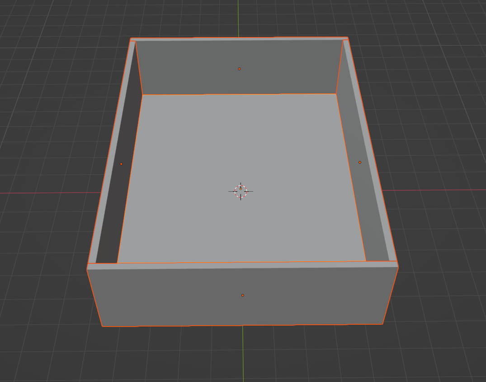
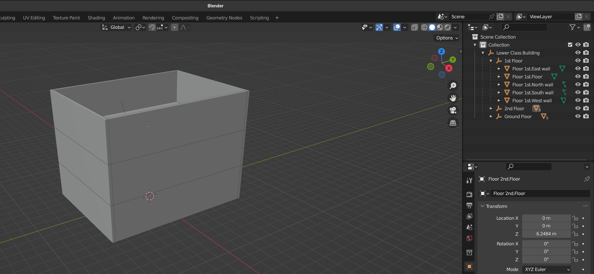

# Victorian Building Generator

A Blender script for generating buildings in the style of late Victorian rural England, using Chat GPT extensively.

> Work in progress, Today you can generate `n` floors! thats it.
>
> A bin packing algorythm should now be developed including A\* to enisre a path, this is going to be hard! :D
>
> _Beep boop beep_ 🤖 Chat GPT says:
>
> A\* is a popular algorithm for pathfinding, while bin packing is a problem of efficiently allocating items into a fixed number of containers (bins) with specific constraints. Combining the two algorithms can be useful for finding an efficient layout for a floor plan that includes both rooms and corridors.
>
> Here's one way you could go about combining the two algorithms:
>
> First, use a bin packing algorithm to determine the placement of rooms within the floor plan. This could involve dividing the floor plan into a grid of cells and placing each room into a set of cells that best fits its dimensions, subject to any additional constraints (such as minimum distances between rooms).
>
> Once you have the room locations determined, use A* to find paths between the rooms. A* works by starting at a given starting point and expanding nodes in the direction of the goal while considering a heuristic function to estimate the distance between the current position and the goal. To create corridor between rooms you can use the algorithm to find paths between the center of the rooms.

Once you have your path, you can start expanding the width of the path to generate the corridor, You will have to check the collision with the rooms and other corridors in order to avoid creating a corridor that intersect with a room or another corridor.

Repeat the process 2 and 3 to create corridors between all the rooms.


_The basic output as it stands_


_The outliner shows the objects are grouped in empties, from buidling root, nests a Ground floor, 1st Floor, then the outer walls_

## Getting Started

To use the Victorian Building Generator, you will need to have Blender installed on your computer. You can download Blender for free from the [official website](https://www.blender.org/download/).

Once you have Blender installed, you can clone this repository and open the `sample.blend` file in Blender. The script is located in the `op.py` file and can be run by pressing `Run Script` in the Text Editor.

## Usage

To generate a building, run the `Generate Building` operator in the 3D Viewport. This will generate a building in the style of late Victorian rural England. The generated building will be selected by default, and you can use the standard Blender tools to modify it as desired.

## Docs

<ul>
<li><p><code>half(n)</code>: This function takes in a number <code>n</code> and returns half of that number.</p></li><li><p><code>pos_neg(n)</code>: This function takes in a number <code>n</code> and returns a dictionary with two keys: "pos" and "neg". The value for "pos" is the original value of <code>n</code>, and the value for "neg" is the negative of <code>n</code>.</p></li><li><p><code>foot(imperial_value)</code>: This function takes in an imperial value in feet and returns the equivalent value in meters.</p></li><li><p><code>cube_ft(width=1, depth=1, height=1, x=0, y=0, z=0)</code>: This function creates a cube with the specified dimensions in feet, and positions the cube at the specified coordinates. The dimensions and coordinates are converted to meters before creating the cube.</p></li><li><p><code>generate_room(width=6, height=10, depth=6, wall_thickness=1, floor_thickness=1)</code>: This function generates a room with the specified dimensions in feet, using the <code>cube_ft</code> function to create the walls, floor, and ceiling of the room. The room is centered at the origin, with the floor at the bottom. The wall thickness and floor thickness are also specified in feet.</p></li><li><p><code>Generate_Room_Operator</code>: This is a Blender operator class that is used to generate a room when the operator is run. The operator can be run by calling <code>bpy.ops.object.generate_room()</code> in the Blender Python console. When the operator is run, it calls the <code>generate_room</code> function to generate the room.</p></li></ul>

examples

```python
# Calculate half of 10
half(10)  # returns 5

# Calculate the positive and negative values of 5
pos_neg(5)  # returns {"pos": 5, "neg": -5}

# Convert 3 feet to meters
foot(3)  # returns 0.9144

# Create a cube with dimensions 6x6x6 feet, positioned at (0, 0, 0)
cube_ft(width=6, height=6, depth=6, x=0, y=0, z=0)

# Generate a room with dimensions 30x10x40 feet, wall thickness of 0.75 feet, and floor thickness of 1 foot
generate_room(
  width=30,
  depth=40,
  height=10,
  wall_thickness=.75
)
```

To run the Generate Room operator, you can use the following code:

```python
bpy.ops.object.generate_room()
```

## Contributing

If you would like to contribute to the development of the Victorian Building Generator, you can submit a pull request with your changes. Please make sure to follow the existing coding style and include appropriate documentation for your changes.

## Project Goals

I persoanlly want to make game assets for this era, I am very interested in Godot, Unreal and VR in historical settings, I also live in rural England so victorian mining towns fasinate me, what am I shooting for? Here is some Dalle 2 generated assets to inspire:


## Development

To run the Victorian Building Generator through the Visual Studio Blender Development plugin, you will need to have both Blender and Visual Studio installed on your computer.

Open Blender and install the Blender Development plugin by going to Edit > Preferences > Add-ons and searching for "Blender Development".
Enable the plugin by checking the checkbox next to it.
In Visual Studio, create a new project and add the op.py file to the project.
In Visual Studio, go to Tools > Blender Development > Set as Startup File. This will set the op.py file as the startup file for the plugin.
In Blender, go to Text Editor > Open. This will open the Text Editor panel.
In the Text Editor panel, open the op.py file.
In the Text Editor panel, press Run Script. This will run the script and generate the building.

To run the Generate Room operator in the Blender Python console, you will need to have the op.py file open in the Text Editor panel.

In Blender, go to Text Editor > Open. This will open the Text Editor panel.
In the Text Editor panel, open the op.py file.
In the Text Editor panel, press Run Script. This will run the script and make the Generate Room operator available in the Blender Python console.
In the Blender Python console, enter `bpy.ops.object.generate_room()` and hit <kbd>Enter</kbd>

For full details of using the Visual Studio Code Blender development plugin visit the projects github

## License

This project is licensed under the MIT License - see the [LICENSE](LICENSE) file for details.
